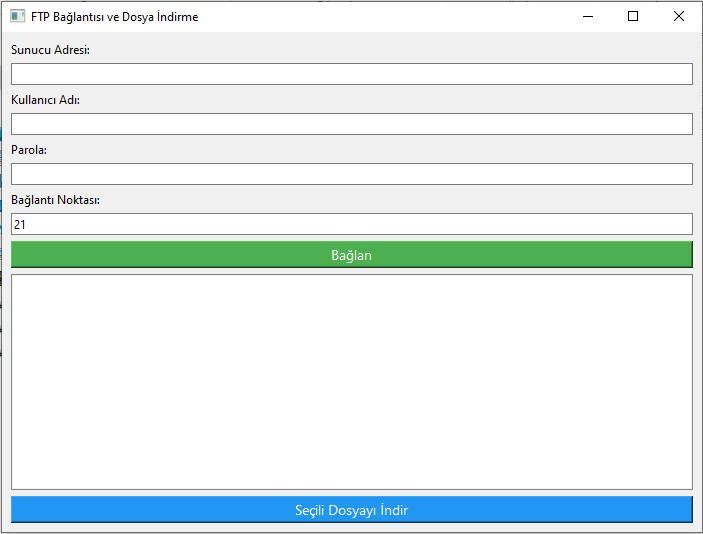

# FTP İstemcisi (PyQt6 Tabanlı)

## Genel Bakış

Bu proje, PyQt6, Python'un yerleşik `ftplib` kütüphanesi ve FileZilla'nın yapılandırmasından FTP sunucu profillerini yüklemek için XML işleme kullanarak oluşturulmuş bir grafiksel FTP istemcisidir. Uygulama, kullanıcıların FTP sunucusuna bağlanmasına, dizinleri gezmesine ve dosya indirmesine olanak tanır. Kullanıcı dostu bir arayüz sunarak, komut satırı karmaşıklığıyla uğraşmak istemeyenler için basit bir dosya transferi aracı sağlar.

## Özellikler

- **FTP Bağlantısı**: Sunucu adresi, kullanıcı adı, parola ve port ile FTP sunucusuna bağlanma.
- **Dizin Gezinme**: Uzak dizinleri gezebilir ve alt klasörlere tıklayarak girebilirsiniz.
- **Dosya İndirme**: Tekil dosyaları veya tüm dizinleri FTP sunucusundan indirebilirsiniz.
- **FileZilla Profil Desteği**: FileZilla'nın son kullanılan sunucu yapılandırmasından FTP sunucusu profil bilgilerini otomatik olarak yükler (hem Windows hem de Linux/Mac yollarını destekler).
- **Grafiksel Arayüz**: FTP bağlantılarını yönetmek için PyQt6 ile oluşturulmuş basit ve kullanıcı dostu bir arayüz.

## Gereksinimler

- Python 3.x
- PyQt6
- ftplib (Python standart kütüphanesinin bir parçasıdır)
- base64 (Python standart kütüphanesinin bir parçasıdır)
- XML yapılandırma dosyası (`recentservers.xml` FileZilla'dan)

## Kurulum

1. **Python 3.x**'i [python.org](https://www.python.org/) adresinden indirin.
2. **PyQt6**'yı `pip` kullanarak kurun:
   ```bash
   pip install PyQt6
   ```

3. **Projeyi indirin**:
   Bu repoyu GitHub üzerinden klonlayabilir veya indirebilirsiniz.

4. **FileZilla Profil Bilgisi**:
   Uygulama, FileZilla yapılandırma dosyasını şu varsayılan yollar üzerinden okumaya çalışır:
   - Linux/Mac: `~/.config/filezilla/recentservers.xml`
   - Windows: `~\AppData\Roaming\FileZilla\recentservers.xml`

   Eğer FileZilla kurulu değilse veya yapılandırma dosyası mevcut değilse, FTP sunucu bilgilerini manuel olarak girmeniz gerekecektir.

## Kullanım

1. Uygulamayı açın.
2. FTP sunucu bilgilerini girin (sunucu adresi, kullanıcı adı, parola ve port).
3. **Bağlan** butonuna tıklayarak bağlantıyı başlatın.
4. Bağlantı sağlandıktan sonra, sunucunun dizin yapısı sol tarafta görünecektir.
5. İstediğiniz klasöre tıklayarak içeriğini görüntüleyin.
6. Bir dosya veya klasör seçip **İndir** butonuna tıklayarak dosyayı bilgisayarınıza indirin.

## Ekran Görüntüleri



## Lisans

Bu proje açık kaynaklıdır ve [MIT Lisansı](LICENSE) altında lisanslanmıştır.
